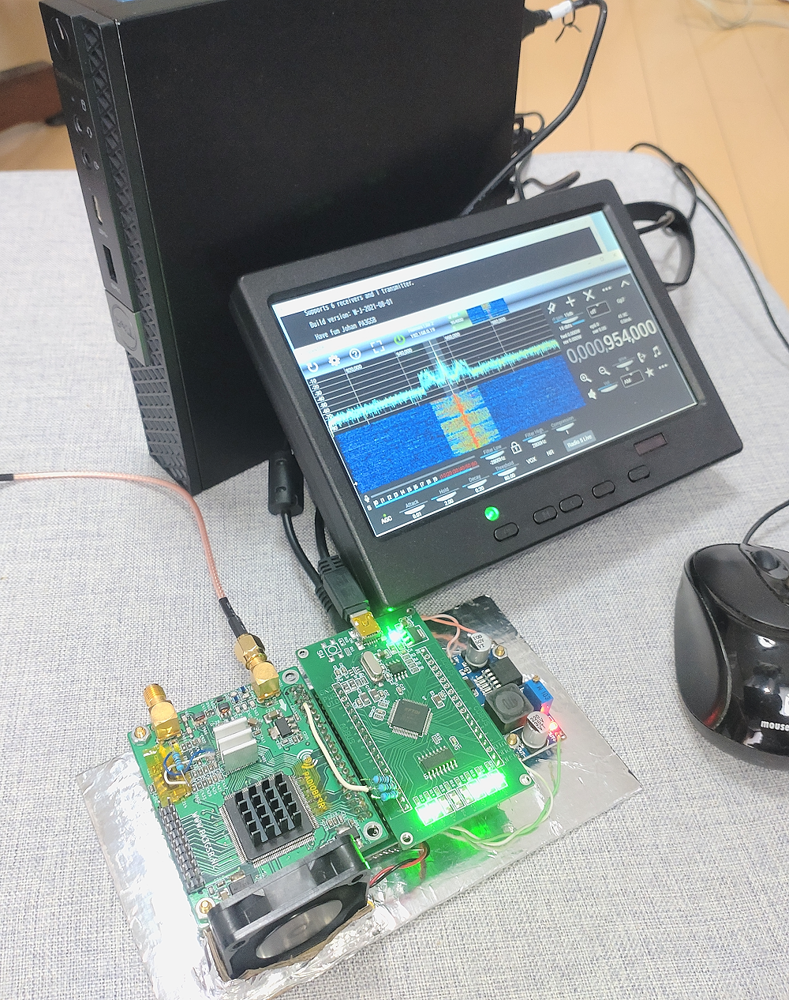

# Radioberry_Juice_connector_board

 beta0.1 Release

This project provides information on how to build an [radioberry-juice](https://github.com/pa3gsb/Radioberry-2.x/tree/master/hardware/juice) using the FT2232HL Development Learning Board, available at low cost on Aliexpress and eBay. (abt. $13 to $18) 
Connector boards make it easy to connect the Radioberry-2 to the FT2232HL Learning Board. 

#### Juice View and Connection

 
 

#### Connetor board View
 
 
